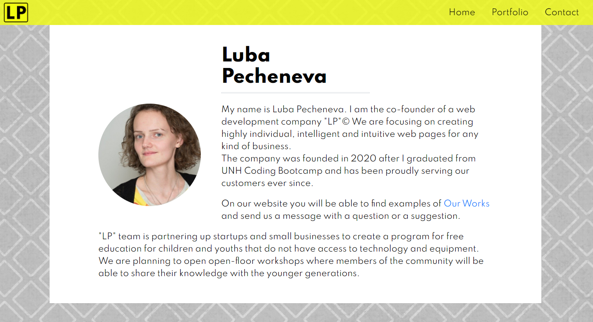
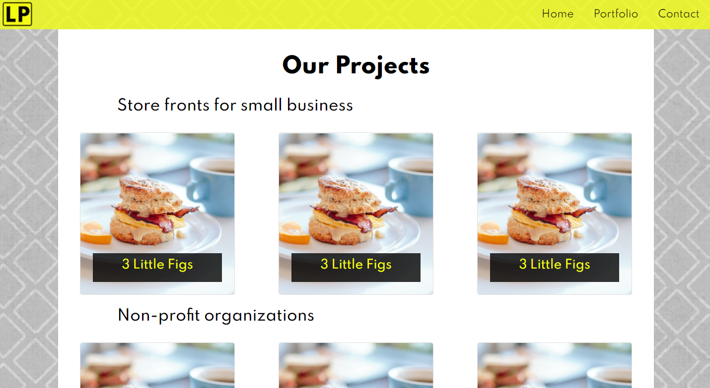

# My Portfolio

Simple-structured portfolio webpage.
https://lp5786766.github.io/02-bootstrapportfolio/

The Website contatins three pages:
1. Home Page.
2. Portfolio Page.
3. Contact Page.

## Home Page

This page is designed to introduce the owner of the portfolio and their story or company's statement.

## Portfolio Page

This page displays works of the owner under two categories. By clicking on the picture you can visit the actial website of the deployed project.

## Contact Page

This page contains contact information and owner's social media links. It also has a contact form, that any customer can fill out if they have any questions.

You can navigate through pages using the navigation bar at the top of each page.

Credits:
3 Little Figs Coffee Shop - 278 Highland Ave, Somerville, MA
Luba Pecheneva
