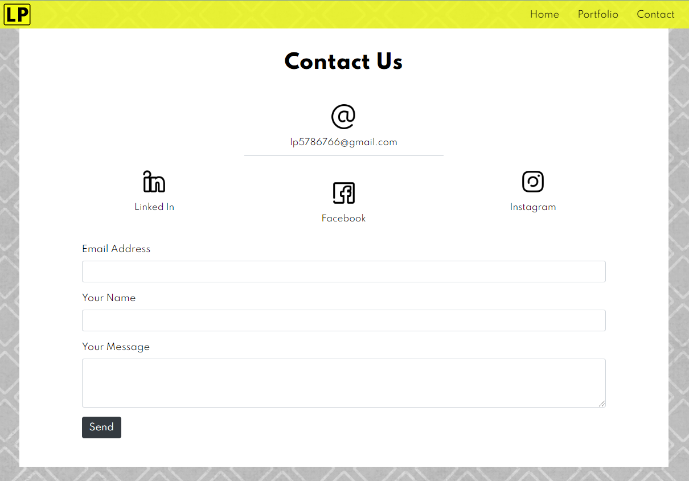

# My Portfolio

## Link to the Portfolio:

[Portfolio](https://lp5786766.github.io/my-portfolio/)

Simple-structured portfolio webpage, created using Bootstrap library.

The Website contatins two pages:
1. Home Page (Introduction/Portfolio).
2. Contact Page.

## Home Page

This page is designed to introduce the owner of the portfolio and their story and professional background.
It also displays works of the owner. By clicking on the picture you can visit the actial website of the deployed project or the repository of the project.

## Contact Page

This page contains contact information and owner's social media links. It also has a contact form, that any customer can fill out if they have any questions.

You can navigate between pages using the navigation bar at the top of each page.

## Credits:

-[Luba Pecheneva](https://github.com/lp5786766)
